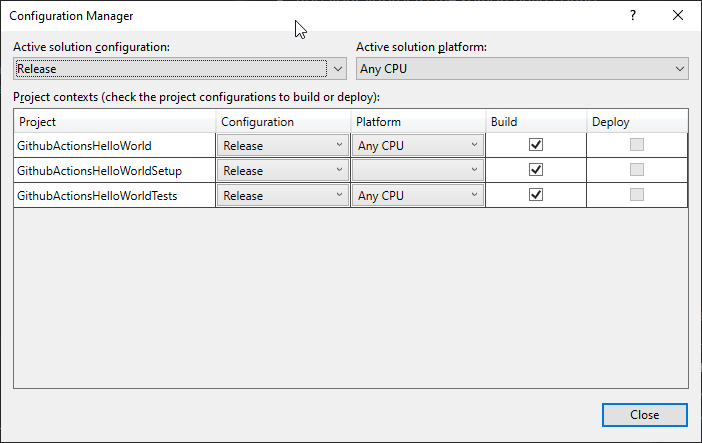

# GithubActionsHelloWorld

[](https://github.com/stesee/GithubActionsHelloWorld/actions/workflows/dotnet.yml)
[](https://int.nugettest.org/packages/GithubActionsHelloWorld)

Hello world built with github action.

## Howto build a legacy vdproj from cli

- Add your vdproj to the soltion build config 
  - Cofiguration Manager -> 

- run the following command
``` ps
	PS C:\GithubActionsHelloWorld> . "C:\Program Files\Microsoft Visual Studio\2022\Professional\Common7\IDE\devenv.exe" GithubActionsHelloWorld.sln /build Release
```

## Howto build an app package (Wap)

### Self signed cert

Publisher common name: InvalidDevTimeCertificate
Password: UnhackablePassword

### Build from cli

``` ps
	PS C:\GithubActionsHelloWorld> . "C:\Program Files\Microsoft Visual Studio\2022\<Edition>\MSBuild\Current\Bin\msbuild" .\GithubActionsHelloWorldWap /p:Configuration=Release /p:AppxBundle=Always /p:AppxBundlePlatforms="x86"
```

### Install

run "C:\GithubActionsHelloWorld\GithubActionsHelloWorldWap\AppPackages\GithubActionsHelloWorldWap_1.0.X.0_Test\Add-AppDevPackage.ps1

## WIX - WIP

https://github.com/kurtanr/WiXInstallerExamples/network

### Harvesting WIX3 notes

  <ItemGroup>
  <Compile Include="example.wxs" />
  </ItemGroup>

 <Target Name="BeforeBuild">
 <HeatDirectory DirectoryRefId="DesignAddInFolder" OutputFile="example.wxs" Directory="../ExampleProgram" ComponentGroupName="ExampleProgramApplicationFilesComponentGroup" ToolPath="$(WixToolPath)" PreprocessorVariable="var.ExampleProgramApplicationFiles" AutogenerateGuids="true" SuppressRootDirectory="true" SuppressRegistry="true" SuppressCom="true" />
   </Target>